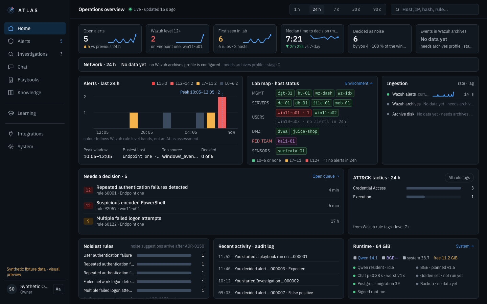
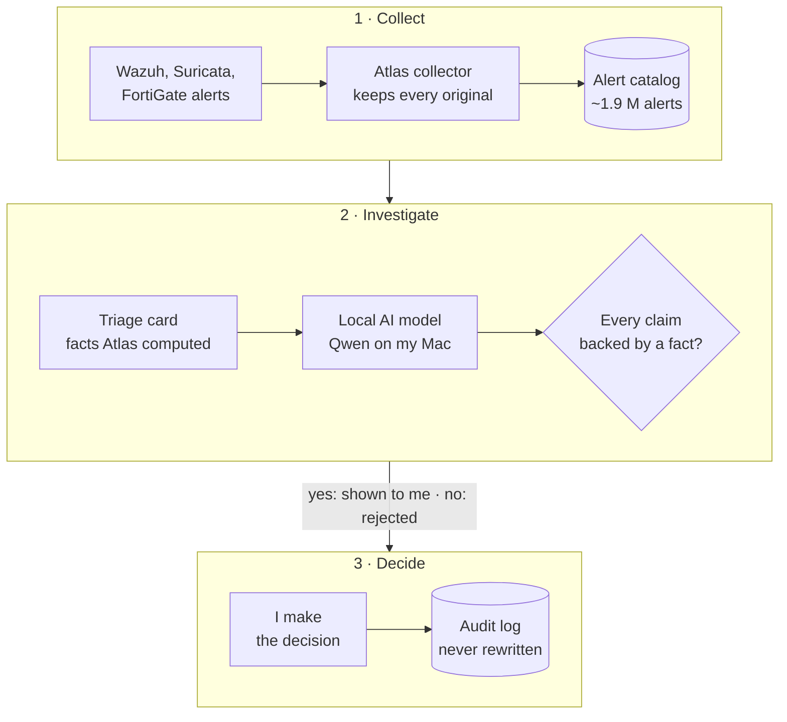

# Atlas

AI-first SOC on top of Wazuh with a local Qwen model on a Mac Studio.

*The Home screen of v1.4.3, rendered on test data. More screens are coming.*

## What this is

Atlas is a tool I built for my own SOC (a security operations centre: the place where someone watches security alerts and decides which ones matter). It takes the alerts from Wazuh (open-source security monitoring), gathers the facts around each one, and lets a language model that runs on my own Mac explain what it sees. Every decision is mine. The model only explains, and only from facts that were actually recorded.

| | |
| --- | --- |
| **What** | An alert-investigation platform for one analyst, with a local AI assistant that shows its evidence |
| **Stack** | Python/FastAPI, PostgreSQL, React/TypeScript, Qdrant, Qwen via MLX; alerts from Wazuh, Suricata and FortiGate |
| **Scale** | About 1.9 million alerts from my lab in the catalog |
| **Status** | v1.4.3, in daily use on my lab since September 2026. The source is not public yet; this repository documents the system |

## Why I built it

Wazuh in my lab fires thousands of alerts a day. Most are routine, a few matter, and telling them apart means opening raw JSON, checking the host, the user, the process and its parent, and remembering what I decided last time. The first time I worked an alert like that by hand, it took me about 30 minutes ([case study 92205](docs/case-study-92205.md)).

Cloud AI assistants were not an option. A command line from a workstation or an internal DNS query is exactly the data I will not send to a third party. And a model that summarises logs freely will invent a parent process or a verdict that is not in the data. In security work a confident wrong answer is worse than no answer.

So the model runs on the same machine as the data, and it is kept in its place: it reads recorded evidence and explains. I decide.

## What I built

One application that:

- collects every alert from Wazuh and keeps the original record unchanged;
- shows on one card who did what to whom, how often it happened before and what I decided last time, before I ask anything;
- walks me through an investigation with a checklist I wrote (a playbook);
- lets a local Qwen model answer my questions with a footnote on every sentence that points at a recorded field;
- records my decision and keeps the whole case as an audit record that cannot be edited afterwards.

## How it works

1. **Collect.** A collector pulls every alert from Wazuh in bounded, resumable batches and stores the original document byte for byte. A gap in collection is shown as a gap, never as "nothing happened".
2. **Prepare.** The alerts become searchable: exact counts, filters by field, a timeline by severity.
3. **Triage.** When I open an alert (triage: deciding whether it matters), one card shows the host, user, process and parent, how often this fired in the last day, week and month, how rare it is across hosts, and what I decided on similar alerts. Atlas computes these; the model is never asked to count.
4. **Investigate.** A playbook I wrote lists the checks. I record each outcome myself. A run that skips a required check closes as "completed with gaps", never as a clean pass.
5. **Ask.** The local model answers from the evidence Atlas selected for that question. Each sentence cites a recorded field; Atlas validates every citation before the answer is shown and rejects an answer that cites what it was not given.
6. **Decide.** I record the decision: false positive, expected activity or a finished investigation. The model then writes a closing summary of the closed record, with citations, and quotes my decision rather than making one.
7. **Look up, on click.** One click sends one public IP, domain, hash or CVE to one named threat-intelligence provider (OSINT: public lookups about known attackers). Private addresses are refused before any network call.

## Security principles

- A human makes every decision. Model output has no write path to decisions, steps or closures.
- The model cites only recorded facts. An answer with a citation Atlas cannot resolve is rejected.
- OSINT only on click. Nothing is sent anywhere automatically.
- Private IPs and internal names never leave the host.
- The audit is immutable. Decisions, steps and collection runs are append-only; history is never rewritten.

More in [docs/security.md](docs/security.md).

## Numbers

| | |
| --- | --- |
| Tests in the release gate | about 6.7k backend and 668 frontend |
| Alert catalog | about 1.9 million records |
| Architecture decisions | 155 ADRs (an ADR is a written, numbered architecture decision) |
| Triage card lookups | 0.5 s over 1 million events |
| Qwen golden set | 15/30 to 27/30 valid cited answers after one prompt revision |
| Install downtime | 2 h 53 min (v1.0) to 44 s (v1.3) |

## Stack

| | |
| --- | --- |
| Backend | Python, FastAPI |
| Database | PostgreSQL |
| Frontend | React, TypeScript |
| Vector index | Qdrant |
| Model | Qwen via MLX (Apple's framework for running models on Apple silicon), on a Mac Studio |
| Alert sources | Wazuh, Suricata, FortiGate |

## How a real alert goes through it

Two cases from my lab, written as what I saw, what the model cited and what I decided:

- [A password-guessing attack on a test web app](docs/case-study-hydra.md): Hydra from my Kali machine against DVWA; a true positive with no compromise.
- [A PowerShell file write that looked like a loader](docs/case-study-92205.md): the Wazuh agent's own configuration check; closed as expected activity.

The components, the trust boundaries and the path of one alert are in [docs/architecture.md](docs/architecture.md).

## What I'd do next

- Scheduled encrypted backups with a weekly restore check, so a backup counts only after it has been restored.
- Noise suggestions that I approve, never automatic muting.
- Similar-case search over my closed investigations with a better embedding model.
- One controlled response, a firewall block of a single IP, with explicit approval, a dry run, a time limit and automatic rollback.
- Users and roles, if the tool ever has a second analyst.

## Contact

- GitHub: [github.com/Evgeniy-Nazarov](https://github.com/Evgeniy-Nazarov)
- The lab Atlas runs on: [soc-homelab-enterprise](https://github.com/Evgeniy-Nazarov/soc-homelab-enterprise)

Built with AI coding assistants under my architecture, security requirements and review.
