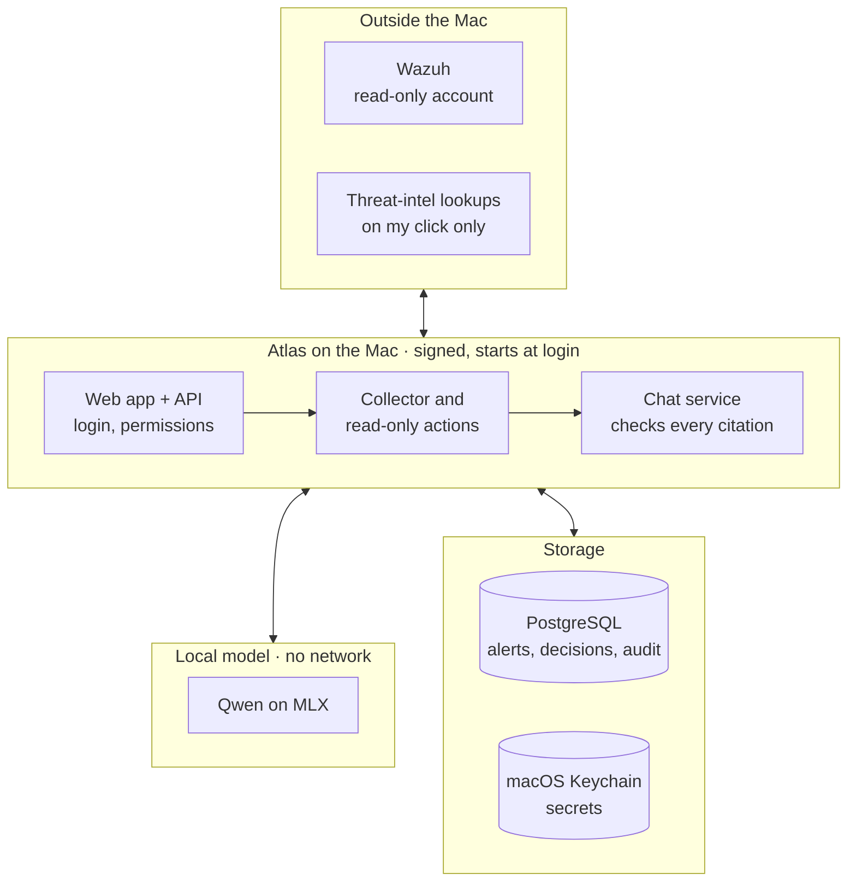
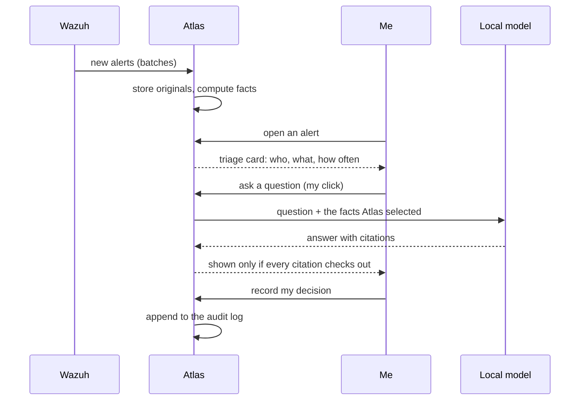

# Architecture

Atlas is a single-machine system: one signed runtime on one Mac Studio, one PostgreSQL instance, a local model, and a read-only connection to the lab's Wazuh indexer. This page shows the components, the trust boundaries between them, and the path of one alert from collection to a closed investigation.

## Components and trust boundaries

| Boundary | What crosses it | What never crosses it |
| --- | --- | --- |
| Lab to Mac | Wazuh alerts, pulled by Atlas with a read-only account | Any write to Wazuh |
| Mac to Internet | One public IP, domain, hash or CVE per human click | Raw alerts, private addresses, internal names, evidence |
| Runtime to Keychain | Nothing directly: only the broker's own signed identity is in the access group | The runtime, its embedded Python, adapters, shells or tests reading a secret |
| Chat to model | The evidence, card facts and computations Atlas selected for this turn | Database access, tool calls, SQL, URLs, commands |
| Model to Atlas | A JSON answer that must validate against a schema and cite supplied handles | Any write to decisions, playbook steps or audit |
| Browser to API | Authenticated same-origin requests | Cross-origin requests, remote scripts, CDN assets |

## The life of one alert

## Collection

One engine serves the initial backfill, the scheduled sync and the manual "Sync now"; they differ only in their trigger. Every batch is a point-in-time search with an exact total. A batch that hits a bound (records, bytes, time, pages) ends with a named reason and resumes later. Short pages, duplicates or a regressing continuation fail closed; there is no retry that could hide a gap.

The original provider document is stored byte for byte with its hash. Every later view, whether a table row, a card fact or a chat citation, points back to it.

## Triage card

Named, versioned, read-only actions run under one time budget when an alert is opened: identity, process lineage, frequency over the last day, week and month, rarity across hosts, prior decisions, environment record and collection coverage. An action that cannot finish in time is shown as unavailable with its reason, never dropped. "Not found" is claimed only inside windows marked as collected.

Lineage follows process-start events by process GUID. A long-lived service root such as the Wazuh agent, started at boot, has no start event inside the window; the chain says so and offers a wider window, instead of reporting "depth 0".

## Evidence-bound chat

- One conversation per alert or investigation, with an append-only transcript.
- Context is chosen by a deterministic resolver first. For an ambiguous question at most one planning pass returns a strict data object: an intent from a fixed list, a few server-issued handles, a time window from a short list. Free SQL, URLs, shell commands or a wider scope are rejected. There is no repair pass and no agent loop.
- Atlas runs at most two fixed query templates with arguments from authenticated context, pins a context revision and runs one generation.
- The answer is strict JSON. Every statement cites handles supplied for that turn; the validator rejects what it cannot resolve. If the model is unavailable, the analyst still sees every saved fact and can close the case. There is no fallback answer.
- The worker admits a request only when memory, swap growth and the context budget allow it. A question that does not fit is refused with a named reason, not truncated.

## Playbooks, decisions and closure

Playbook versions are immutable once accepted, and a run binds to one version for its whole life. Step outcomes (supports, contradicts, insufficient data, not applicable, recorded) are append-only revisions written by a human. A run that skipped a required step closes as "completed with gaps" with a list of what was and was not checked. The closing summary is generated afterwards, over the closed record only.

## Delivery

The runtime, the frontend snapshot and the credential broker are built as separate signed artifacts with immutable manifests. The quality workflow runs on the exact candidate commit before an install. A normal release replaces the runtime and frontend without a migration and with under a minute of downtime. A migration release takes a verified encrypted backup first and is rehearsed with a rollback before the real window.

## Design notes

- PostgreSQL is the only authority. Projections, caches, the card and the vector index are derived and rebuildable.
- Journals, not flags. Alert and investigation status is computed from the resolution journal; nothing is updated in place.
- Named failures. Every bound has a name, and hitting one is a visible outcome, never a partial result presented as complete.
- Small releases. Most installs ship without a migration.
